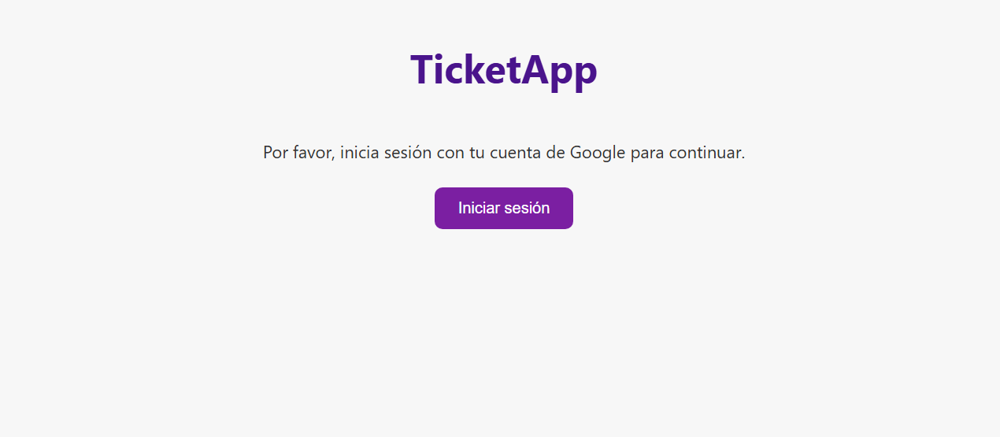
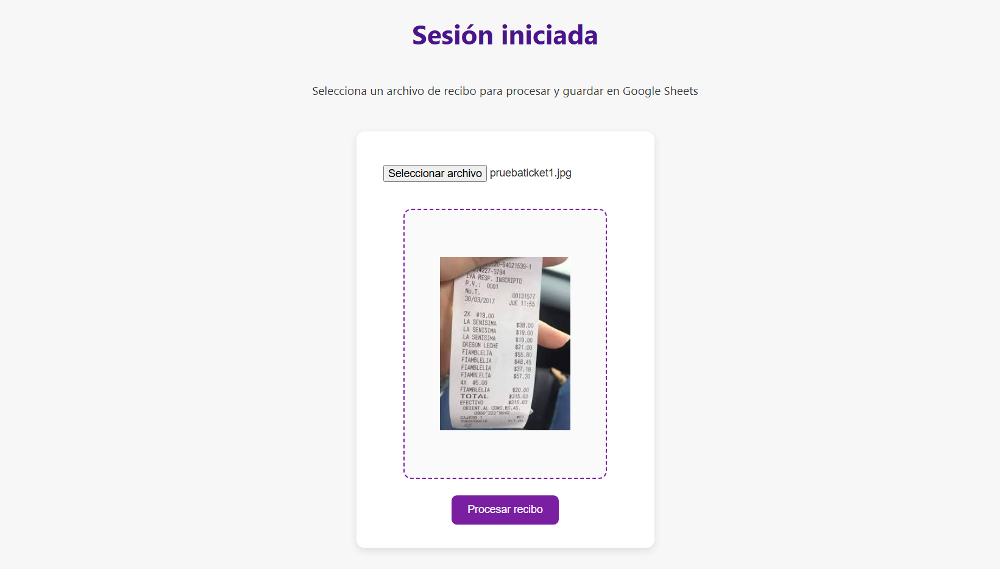
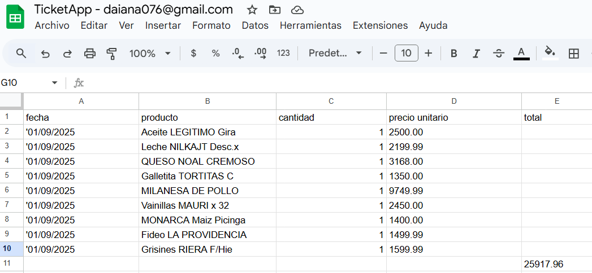

# Ticket App: Una API para Procesar Recibos (Versión Web) 📄

### Visión General del Proyecto

*Ticket App* es una **aplicación web y API** de procesamiento de recibos desarrollada en **Python** utilizando el framework **Flask**. Su objetivo principal es automatizar la extracción de datos desde imágenes de recibos y organizar esa información de manera estructurada en una hoja de cálculo de **Google Sheets**, preparada para análisis y seguimiento.

Esta versión es la evolución de un proyecto original de escritorio creado en **Java**, modernizando y extendiendo sus funcionalidades a un entorno web accesible y escalable.

---

### 🚀 Características Clave

* **Procesamiento de Imágenes con IA**
    * Utiliza la **Google Cloud Vision API** para extraer texto de forma precisa desde imágenes de recibos.
    * Permite trabajar con distintos formatos y calidades de imagen.

* **Análisis de Datos con Gemini**
    * Emplea **Gemini Language Model** para interpretar el texto extraído y clasificarlo en:
        * Productos
        * Cantidades
        * Precio unitario
        * Total general
    * Realiza la normalización de fechas para que todos los productos de un recibo compartan la misma fecha.
    * Maneja conversiones de fechas tipo Excel y garantiza la coherencia de los datos extraídos.

* **Almacenamiento en Google Sheets**
    * Guarda los datos procesados en **Google Sheets**, manteniendo la fecha como texto literal para evitar errores de formato y los precios con dos decimales.
    * El total general es extraído si está explícito o calculado si no se encuentra.
    * Es compatible con hojas de cálculo individuales por usuario, gestionadas mediante `SheetFactory`.

* **Depuración y Logs**
    * Durante el procesamiento, la aplicación genera archivos de depuración en la carpeta `receipt_debug`:
        * `raw_text.txt` → texto crudo extraído de la imagen.
        * `gemini_output.json` → resultado JSON devuelto por Gemini.
        * `normalized_output.json` → resultado final normalizado antes de guardarlo en Sheets.
    * Esto permite verificar cada paso del flujo de datos durante el desarrollo.

* **Arquitectura Limpia (Clean Architecture)**
    * El proyecto está diseñado siguiendo los principios de la arquitectura limpia, separando las preocupaciones del negocio de la tecnología de implementación.
    * Presenta una estructura de capas clara que facilita la escalabilidad, la mantenibilidad y las pruebas unitarias:
        * Capa de Aplicación: Lógica de negocio de alto nivel.
        * Capa de Infraestructura: Manejo de servicios externos (APIs, bases de datos).
        * Capa de Dominio: Entidades y reglas de negocio.

---

### 💻 Estado del Proyecto

Actualmente, la aplicación es funcional en entorno local, con pruebas completas del flujo de recibos a Google Sheets.

Está preparada para despliegue en **Google Cloud Platform**, con:
* Configuración de credenciales para Cloud Vision y Google Sheets.
* Logs y depuración listos para monitorizar la ejecución en producción.

